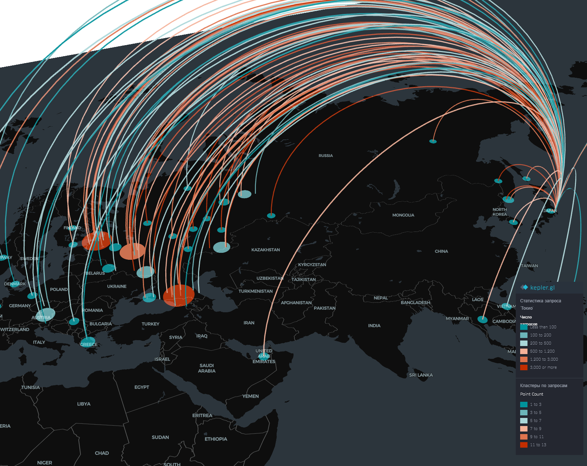

# Проект Kepler.gl - Статистика запросов по Токио

## Описание

Этот проект представляет интерактивную карту визуализации данных, созданную с помощью инструмента Kepler.gl. На карте отображается статистика запросов, связанных с Токио, показывая различные точки запросов и их интенсивность по всему миру.

## Визуализация

## Особенности

- **Глобальная визуализация**: Отображает связи между различными географическими точками и Токио
- **Цветовая кодировка**: Интенсивность запросов отображается разными цветами:
  - Бирюзовый: 1-100 запросов
  - Голубой: 100-200 запросов
  - Светло-голубой: 200-500 запросов
  - Оранжевый: 500-1200 запросов
  - Ярко-оранжевый: 1200-3000 запросов
  - Красный: 3000+ запросов

## Легенда

Карта включает две легенды:
- **Интенсивность запросов**: От 1-100 до 5000+ запросов
- **Количество точек**: От 1-3 до 11-13 точек

## Лицензия

MIT